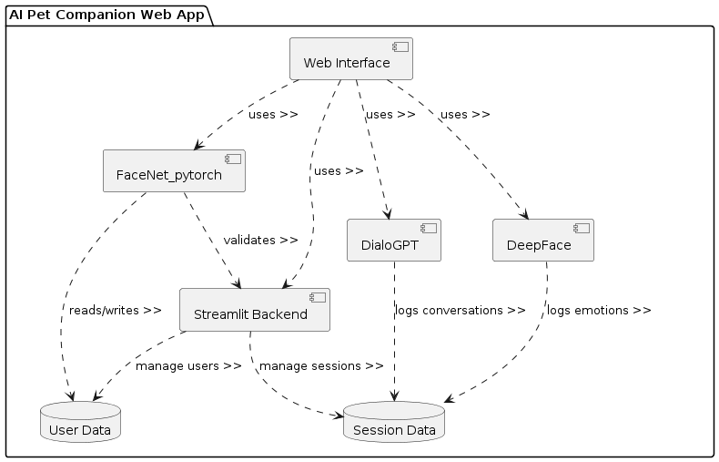

# AI Pet

Welcome to the AI Pet repository! This project aims to create a virtual pet powered by AI technologies. The pet can detect its owner using `facenet_pytorch`, detect the owner's emotions with `deepface`, and communicate with the owner using `dialoGPT`.

## Features

- **Owner Detection**: The AI pet can recognize its owner's face using the `facenet_pytorch` library. This technology utilizes neural network models to analyze facial features and compare them with a known dataset to authenticate the owner.
- **Emotion Detection**: Using `deepface`, the pet can detect the owner's emotions, allowing for more personalized interactions. The AI pet assesses facial expressions in real-time to infer emotional states, ensuring that responses are empathetically aligned with how the owner feels.
- **Communication**: The pet can engage in conversations with the owner using `dialoGPT`, providing a unique and interactive experience. This conversational model is fine-tuned to the context of the interaction, incorporating the owner's emotional state to deliver a pet-like communication experience.

## System Architecture

The AI Pet employs a sophisticated system architecture, integrating various AI technologies to create a seamless and intuitive user experience.

### Architecture Diagram

### Data Flow Diagram

### Sequence Diagram

### Use Case Diagram

## Web App

The repository includes a web app built with `Streamlit`, providing a user-friendly interface for interacting with the AI pet. The web app orchestrates the interactivity between the AI modules, manages data, and presents the user interface for live interactions.

### User Experience Flow

The interaction flow is designed to be engaging and intuitive:
1. The user is initially authenticated using facial recognition.
2. Upon successful authentication, the AI pet begins a chat session where it can communicate and respond based on the detected emotions.
3. The chat interface includes a history view, displaying past interactions and emotional responses.

## Usage

To experience the AI pet, follow these steps:

1. Clone the repository to your local machine.
2. Install the required libraries using `pip install -r requirements.txt`.
3. Run the web app using `streamlit run AI_Pet_Webapp.py`.

## Screenshots

### Main Chat Screen

### Do Not Recognize Owner/Add Owner Screen

## Contributing

Contributions are welcome! If you have any ideas for improving the AI pet, feel free to fork this repository, create a feature branch, and submit a pull request with your enhancements.
